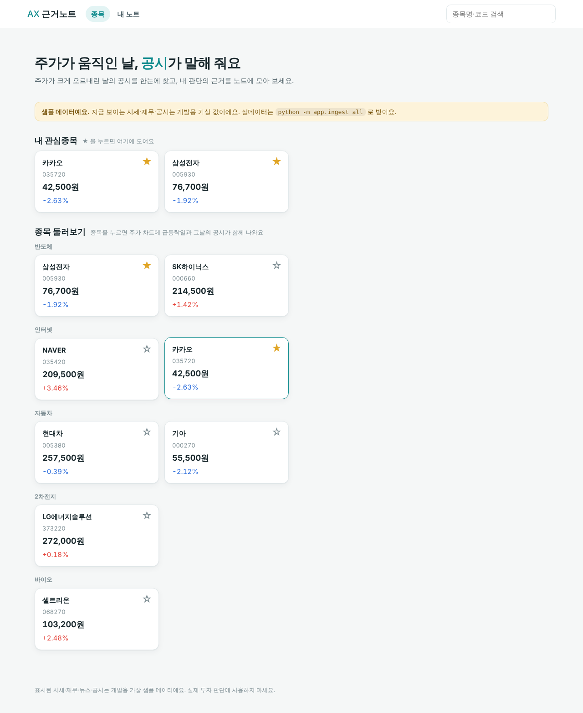
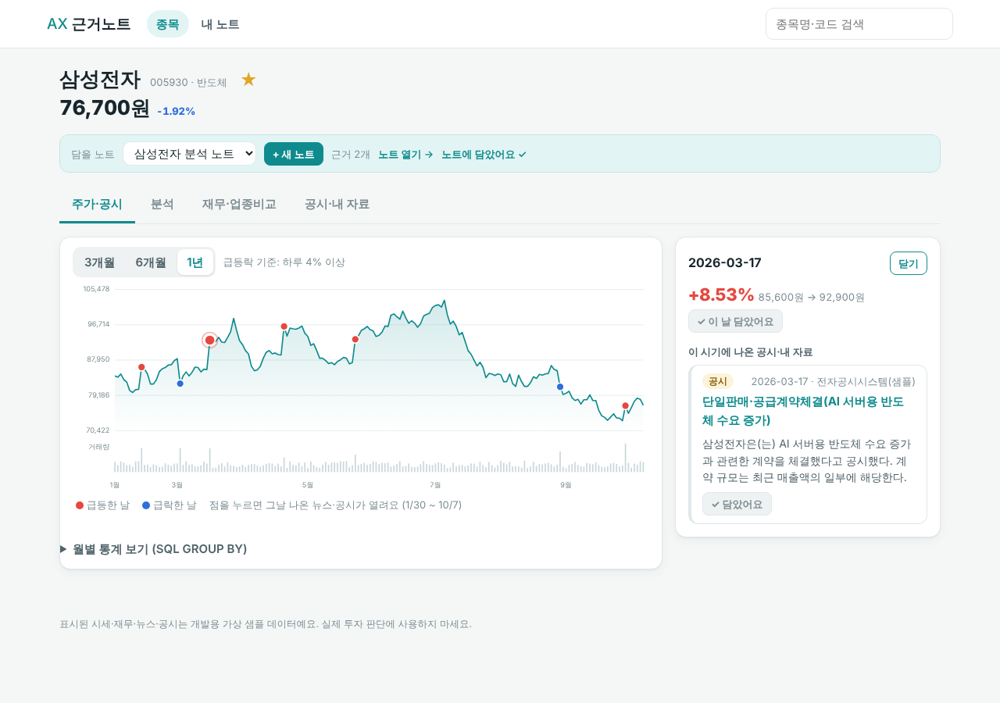
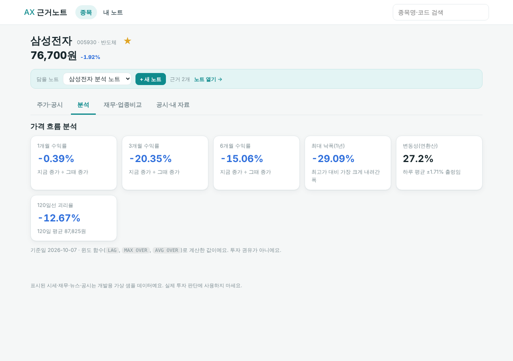
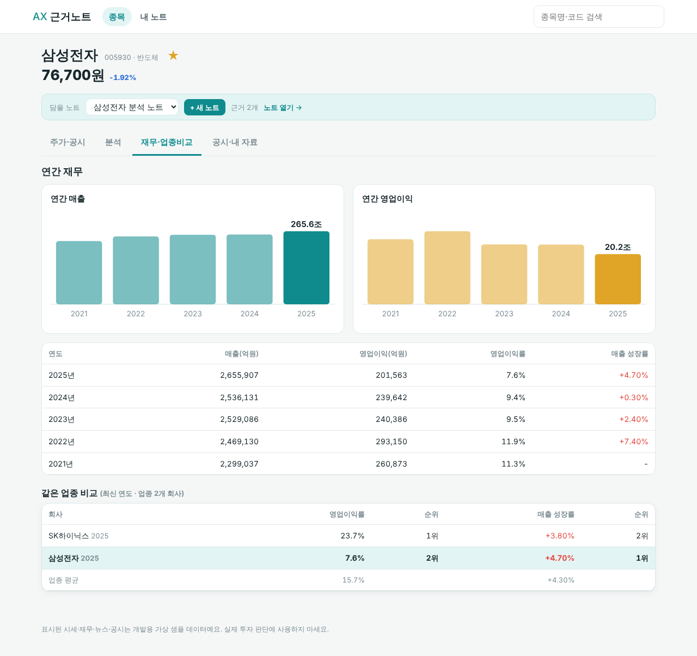
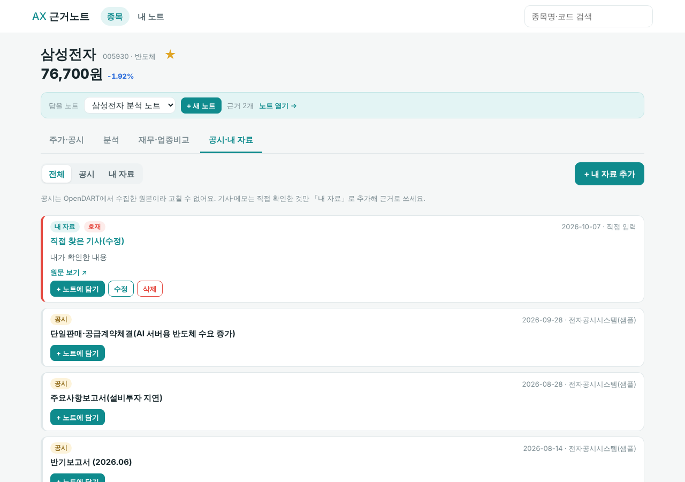
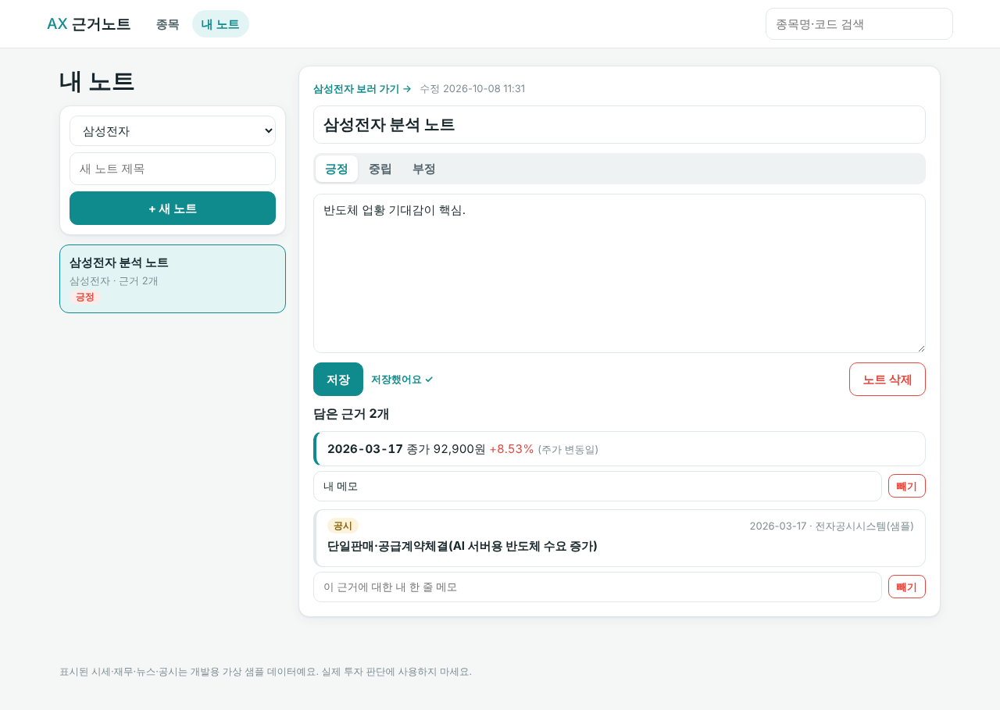

# AX 근거노트 v2

> 급등락한 날의 **공시와 내가 확인한 기사**를 근거로 모아, 나만의 종목 분석 노트를 쓰는 대시보드.
> 반 프로젝트 주제 #4 "AI 주식 종목 분석 대시보드"를 **1차 프로젝트 범위(DB 설계·SQL·FastAPI CRUD)** 에 맞춰 만든 버전이에요.

## v1 에서 달라진 점
| | v1 | **v2** |
|---|---|---|
| 데이터 | 전부 가상 샘플 | **pykrx 시세 + OpenDART 공시·재무 실제 수집** (샘플은 개발용으로만) |
| 뉴스 | 샘플 뉴스 | **자동 수집 안 함** — 관련 없는 기사가 섞이는 문제를 피해, 내가 확인한 기사만 "내 자료"로 입력 |
| AI 질의응답 | LIKE 검색 기반 답변 | **뺌** (LLM·RAG 제외 항목) |
| 분석 | 월별 통계 | 수익률·120일선 괴리·최대 낙폭·변동성, 연간 재무, 업종 내 순위 |
| 그 외 | | 관심종목, 수집 기록(`ingestion_log`), 테스트, EXPLAIN 비교, 문서 |

## 제외 항목 준수
JWT·OAuth2·React·상태관리·GitHub Actions·E2E 자동화·LLM·LangChain·RAG·Vector DB·Function Calling·AI Agent 를 **쓰지 않았어요.**
화면은 바닐라 JS, 로그인 대신 브라우저별 `X-Client-Id` 헤더를 써요.

## 화면
| 홈 | 주가·공시 | 분석 |
|---|---|---|
|  |  |  |

| 재무·업종비교 | 공시·내 자료 | 내 노트 |
|---|---|---|
|  |  |  |

## 실행
```bash
cd backend
pip install -r requirements.txt
uvicorn app.main:app --reload       # http://127.0.0.1:8000  (처음엔 가상 샘플 데이터가 들어가요)
```
API 문서는 `/docs`. PostgreSQL 은 `DATABASE_URL` 환경변수만 바꾸면 돼요 (`backend/.env.example`).

### 실제 데이터로 바꾸기
```bash
export DART_API_KEY=발급받은키
pip install pykrx
python -m app.ingest init-db --reset
python -m app.ingest all            # 업종·종목 → 시세 → 공시 → 재무
python -m app.ingest status
```
뉴스는 종목 화면의 **공시·내 자료 → + 내 자료 추가** 로 직접 넣어요.

## 구조
```
db/schema.sql            DDL (9개 테이블, 제약·인덱스)
backend/app/sql.py       모든 SQL (윈도 함수·CTE·GROUP BY·UPSERT)
backend/app/repo.py      SQL 실행 + 분석 계산
backend/app/events.py    급등락일 ↔ 공시 연결 규칙
backend/app/routers/     companies · documents · notes · watchlist · system
backend/app/ingest/      수집 (parsers · providers · jobs · store · CLI)
backend/app/static/      화면 (index.html · app.js · styles.css)
backend/tests/           test_logic · test_ingest · test_api
scripts/explain.py       인덱스 유무 EXPLAIN 비교
```

## 문서
[요구사항](docs/요구사항정의.md) · [ERD·DB 설계](docs/ERD.md) · [API](docs/API.md) · [데이터 수집](docs/데이터수집.md) · [EXPLAIN](docs/EXPLAIN.md) · [테스트 결과](docs/테스트결과.md)

## 검증 상태 (정직하게)
- ✅ SQL·분석·수집 로직 테스트 19개 통과 (sqlite3), 화면 흐름 브라우저 확인
- ⚠️ **FastAPI 서버, `test_api.py`, pykrx/OpenDART 실제 호출, PostgreSQL 은 만든 환경에서 실행해 보지 못했어요.** 처음 돌릴 때 오류가 날 수 있으니 `pytest backend/tests` 부터 확인하세요.
- 샘플 데이터는 가상이에요. 투자 판단에 쓰지 마세요.

## 다음 단계 아이디어
- 2차에서: 수집한 공시·내 자료에 대해 뉴스 후보를 "확인 대기" 목록으로 보여 주고 사람이 승인 (자동 수집의 부정확 문제 완화)
- 분기 재무, PER/PBR, 종목 확대
