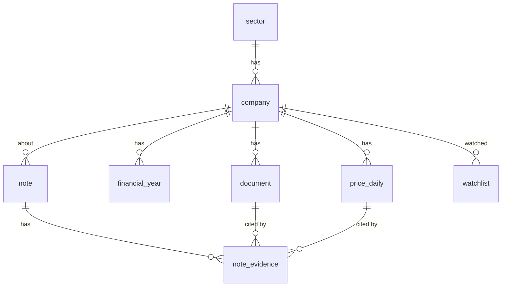

# ERD · DB 설계

| 테이블 | 핵심 컬럼 | 제약 |
|---|---|---|
| sector | sector_id, name | name UNIQUE |
| company | code, name, market, sector_id, corp_code | code UNIQUE, FK sector |
| price_daily | company_id, trade_date, OHLCV | UNIQUE(company, date), CHECK 저가≤시·종가≤고가 |
| financial_year | company_id, fiscal_year, revenue, operating_profit, net_income | UNIQUE(company, year) |
| document | doc_type(news/filing), title, body, source, rcept_no, url, created_by | rcept_no UNIQUE, **CHECK: 공시는 소유자 없음 / 뉴스는 소유자 있음** |
| note | client_id, company_id, title, memo, stance | CHECK stance |
| note_evidence | note_id, doc_id, price_id, comment | **CHECK: doc_id·price_id 중 정확히 하나**, ON DELETE CASCADE |
| watchlist | client_id, company_id | UNIQUE(client, company) |
| ingestion_log | job, source, status, row_count, message, finished_at | CHECK status |

## 설계 메모
- **정규화**: 업종은 sector 로 분리(중복 제거). 근거는 note_evidence 로 분리해 노트 1 : 근거 N 을 표현. 공시와 내 기사를 한 `document` 표에 두고 `doc_type` 으로 구분했어요.
- **금액 단위**: 재무는 OpenDART 원 단위를 **억원**으로 바꿔 저장.
- **"소유자" 설계**: 공시는 모두에게 보이고(created_by NULL), 내 자료는 만든 사람에게만 보여요(SQL `WHERE created_by IS NULL OR created_by = :client`).
- 인덱스와 실행 계획은 [EXPLAIN.md](EXPLAIN.md), 전체 DDL 은 [db/schema.sql](../db/schema.sql).
