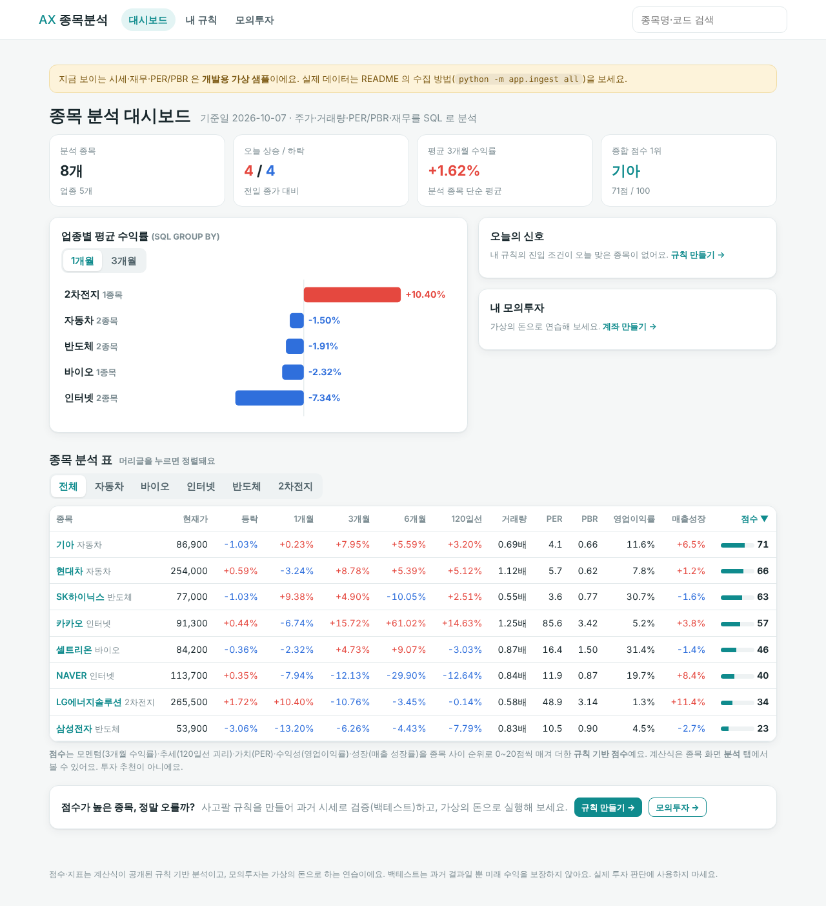
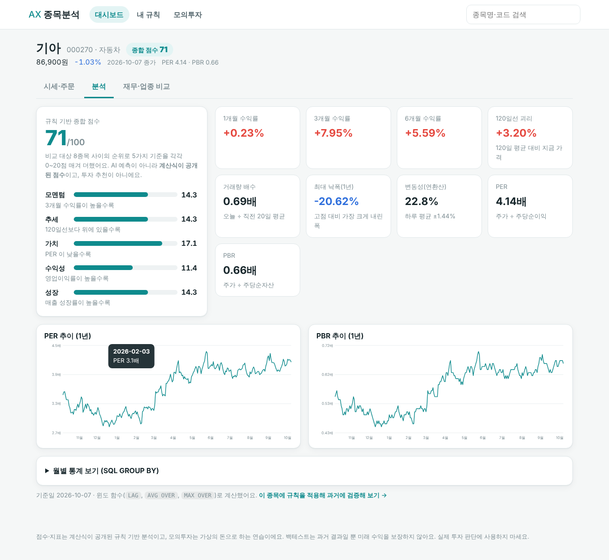
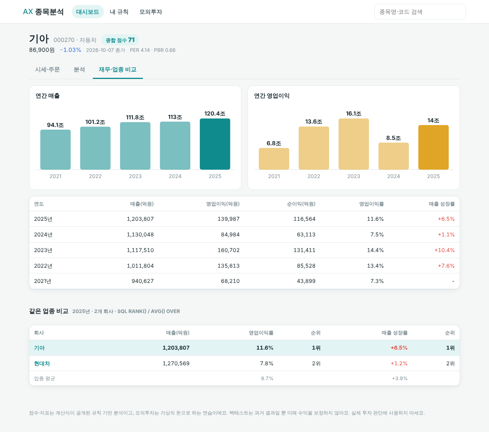
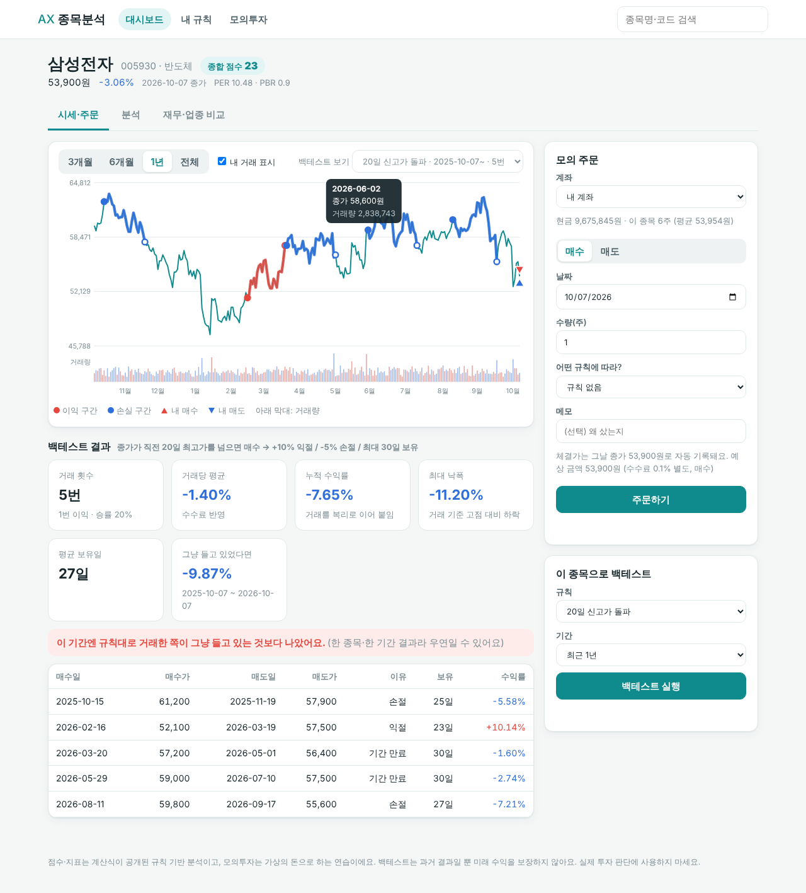
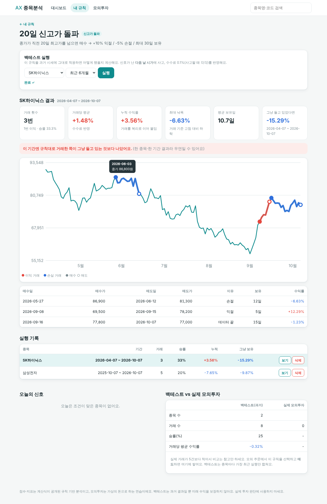
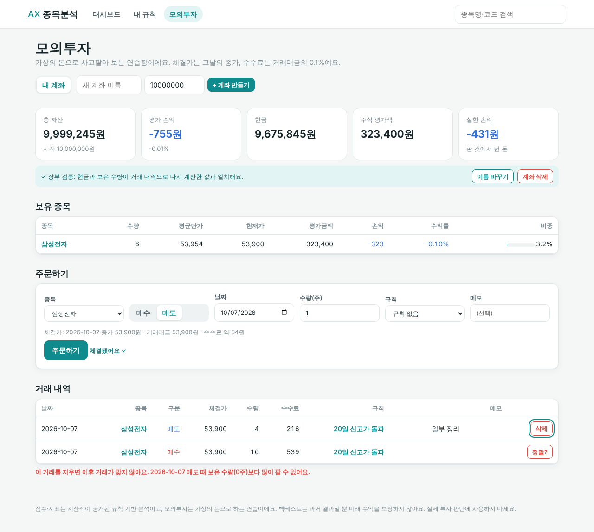
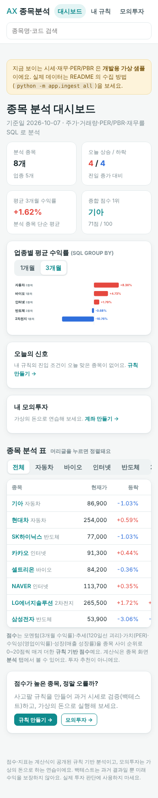

# AX 종목 분석 대시보드

> 주제 #4 **"AI 주식 종목 분석 대시보드"** 를 1차 프로젝트 지침대로 **뉴스 수집·RAG 기업 분석을 빼고** 만든 버전이에요.
> **주가·거래량·PER/PBR·매출·영업이익을 수집 → SQL 로 분석 → 투자정보 대시보드**로 보여 주고,
> LLM 대신 **계산식이 공개된 종합 점수**와 **규칙 검증(백테스트)·모의투자**로 "그 분석이 맞는지" 확인할 수 있게 했어요.

## 주제·지침 준수
- 주제의 데이터 중 **주가·거래량·PER·PBR·매출·영업이익** ✅ / 뉴스·공시(→ Vector DB → RAG 용) ❌ 제외 → [주제 대조표](docs/주제대조.md)
- JWT·OAuth2·React·React 상태관리·GitHub Actions/CI·E2E 자동화·LLM·LangChain·RAG·Vector DB·Function Calling·AI Agent **사용 안 함**
- 화면은 바닐라 JS, 로그인 대신 브라우저별 `X-Client-Id` 헤더

## 화면
| 대시보드 | 종목 분석 | 재무·업종 비교 |
|---|---|---|
|  |  |  |

| 시세·주문(+백테스트 표시) | 규칙 백테스트 | 모의투자 | 모바일 |
|---|---|---|---|
|  |  |  |  |

## 기능
1. **종목 분석 대시보드(홈)** — 시장 요약, 업종별 평균 수익률(`GROUP BY`), 전 종목 분석 표(1·3·6개월 수익률, 120일선 괴리, 거래량 배수, PER, PBR, 영업이익률, 매출 성장률, 종합 점수) 정렬·업종 필터
2. **종목 화면** — 시세·거래량 차트 / 분석 탭(지표 카드, PER·PBR 추이, 월별 통계, 점수 구성) / 재무·업종 비교 탭(5개년 막대, 업종 내 `RANK`)
3. **종합 점수(0~100)** — 모멘텀·추세·가치·수익성·성장을 종목 간 순위로 20점씩. 계산식 공개 → [분석지표.md](docs/분석지표.md)
4. **규칙 + 백테스트** — 진입 조건 3종 + 익절·손절·보유일. 다음 날 시가 매수·수수료 반영, "그냥 들고 있었다면"과 비교
5. **모의투자 장부** — 체결가는 그날 종가, 잔고 부족·초과 매도·장부를 깨는 삭제 거절, 현금·수량 감사
6. **비교** — 규칙별 백테스트 성적 vs 실제 모의투자 성적, 오늘의 신호

## 실행
```bash
cd backend
pip install -r requirements.txt
uvicorn app.main:app --reload       # http://127.0.0.1:8000  (처음엔 가상 샘플 데이터가 들어가요)
```
API 문서는 `/docs`. PostgreSQL 은 `DATABASE_URL` 환경변수만 바꾸면 돼요(`backend/.env.example`).

### 실제 데이터로 바꾸기
```bash
pip install pykrx
export DART_API_KEY=발급받은키      # https://opendart.fss.or.kr (재무용, 없으면 재무 단계만 건너뜀)
python -m app.ingest init-db --reset
python -m app.ingest all            # 종목 → 시세 → PER/PBR → 재무
```

## 구조
```
db/schema.sql            DDL (11개 테이블, 제약·인덱스)
backend/app/sql.py       정적 SQL (대시보드 DASH_CTE, 업종 집계, 재무·업종 비교 …)
backend/app/scoring.py   규칙 기반 종합 점수
backend/app/strategy.py  진입 신호 SQL + 백테스트 시뮬레이션
backend/app/ledger.py    모의투자 장부 재계산
backend/app/service.py   모든 업무 로직 (라우터는 이걸 부르기만 해요)
backend/app/dbapi.py     SQLAlchemy / sqlite3 공통 실행 어댑터
backend/app/routers/     companies · rules · accounts · system(대시보드·상태)
backend/app/ingest/      수집 (pykrx 시세·PER/PBR, OpenDART 재무)
backend/app/static/      화면 (index.html · app.js · styles.css)
backend/tests/           test_dashboard · test_strategy · test_service · test_ingest · test_api
scripts/explain.py       인덱스 유무 EXPLAIN 비교
```

## 문서
[주제 대조표](docs/주제대조.md) · [요구사항](docs/요구사항정의.md) · [ERD·DB 설계](docs/ERD.md) · [분석 지표·점수](docs/분석지표.md) · [백테스트 설명·한계](docs/백테스트설명.md) · [API](docs/API.md) · [데이터 수집](docs/데이터수집.md) · [EXPLAIN](docs/EXPLAIN.md) · [테스트 결과](docs/테스트결과.md)

## 검증 상태 (정직하게)
- ✅ 대시보드 SQL·점수·신호·백테스트·장부·수집 로직 테스트 **42개 통과**(sqlite3). 화면 흐름은 같은 service 를 쓰는 목 서버에서 브라우저로 확인
- ⚠️ **FastAPI 서버, `test_api.py`, pykrx·OpenDART 실제 호출, PostgreSQL 은 만든 환경에서 실행해 보지 못했어요.** 처음 돌릴 때 `pytest backend/tests` 부터 확인하세요.
- 샘플 시세·재무·PER/PBR 은 난수로 만든 가짜예요. 점수·백테스트는 투자 판단에 쓰면 안 돼요.

## 2차 프로젝트로 이어 가기
원래 주제의 "SQL + RAG 결합형"은 이 DB 위에 **뉴스·공시 수집 → Vector DB → RAG → LLM 종목 보고서**를 얹으면 완성돼요. 그때 LLM 보고서가 이 대시보드의 숫자(SQL)를 근거로 쓰게 하면 좋아요.
