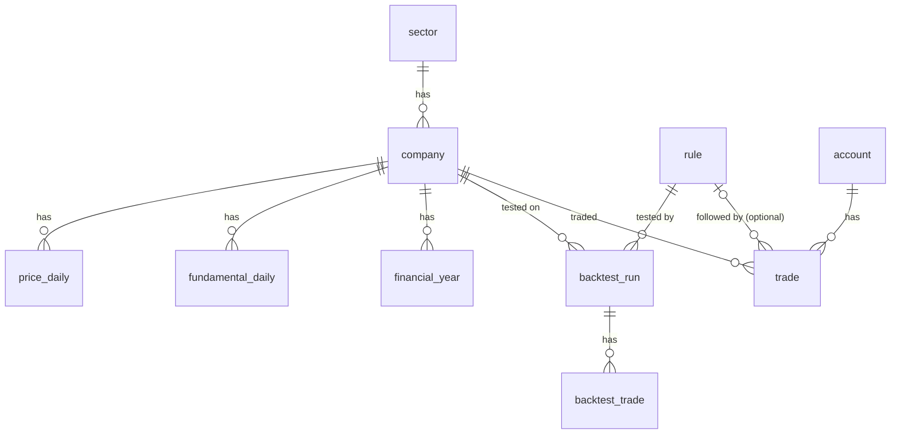

# ERD · DB 설계

| 테이블 | 핵심 컬럼 | 제약 |
|---|---|---|
| sector, company, price_daily | 종목(+OpenDART 고유번호)·일봉 | UNIQUE(company, date), CHECK 저가≤시·종가≤고가 |
| fundamental_daily | company_id, trade_date, per, pbr, eps, bps | UNIQUE(company, date), PER 계산 불가면 NULL |
| financial_year | company_id, fiscal_year, revenue, operating_profit, net_income (억원) | UNIQUE(company, year), CHECK 연도 범위 |
| rule | client_id, name, entry_type, entry_param, take_profit_pct, stop_loss_pct, max_hold_days | UNIQUE(client, name), **CHECK entry_type ∈ 3종, 모든 수치 > 0, 보유일 1~250** |
| backtest_run | rule_id, company_id, rule_text, 기간, 거래 수·승수, 평균·누적·MDD·벤치마크 | FK rule **ON DELETE CASCADE**, CHECK 승수 ≤ 거래 수 |
| backtest_trade | run_id, 진입·청산 일자·가격, exit_reason, return_pct | FK run CASCADE, CHECK exit_date ≥ entry_date, reason ∈ tp/sl/time/end |
| account | client_id, name, initial_cash, **cash** | UNIQUE(client, name), **CHECK cash ≥ 0** |
| trade | account_id, company_id, rule_id(선택), side, date, price, qty, fee, memo | FK account CASCADE, **FK rule ON DELETE SET NULL**, CHECK side/qty/price/fee |
| ingestion_log | job, source, status, row_count | CHECK status |

## 설계 메모
- **정규화**: 규칙·백테스트 요약·백테스트 거래·계좌·거래를 분리(3정규형). 보유 수량·평균단가는 `trade` 에서 계산하므로 저장하지 않아요(중복 저장은 어긋남의 원인).
- **일부러 한 비정규화 2가지**
  1. `account.cash` — 거래마다 같이 갱신해 `CHECK(cash >= 0)` 로 DB 수준에서 잔고 부족을 막아요. 대신 거래 합계와 어긋나지 않는지 **감사 쿼리**(`AUDIT_CASH`)로 매번 확인해요.
  2. `backtest_run.rule_text` — 실행 당시 규칙 설명을 복사해 둬요. 나중에 규칙을 고쳐도 옛 결과가 어떤 규칙이었는지 알 수 있어요.
- **삭제 정책**: 규칙 삭제 → 백테스트 CASCADE 삭제, 모의 거래는 남기고 `rule_id` 만 NULL(거래 기록은 지우면 안 되니까). 계좌 삭제 → 거래 CASCADE.
- **가격은 서버가 채움**: 거래 가격을 사용자가 입력하지 못하고 `price_daily` 의 그날 종가로 기록돼요(마음대로 가격을 쓰는 조작 방지).
- 인덱스와 실행 계획은 [EXPLAIN.md](EXPLAIN.md), 전체 DDL 은 [db/schema.sql](../db/schema.sql).
