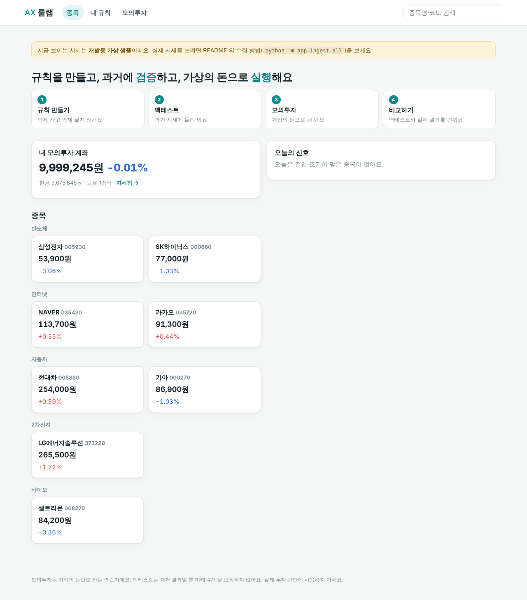
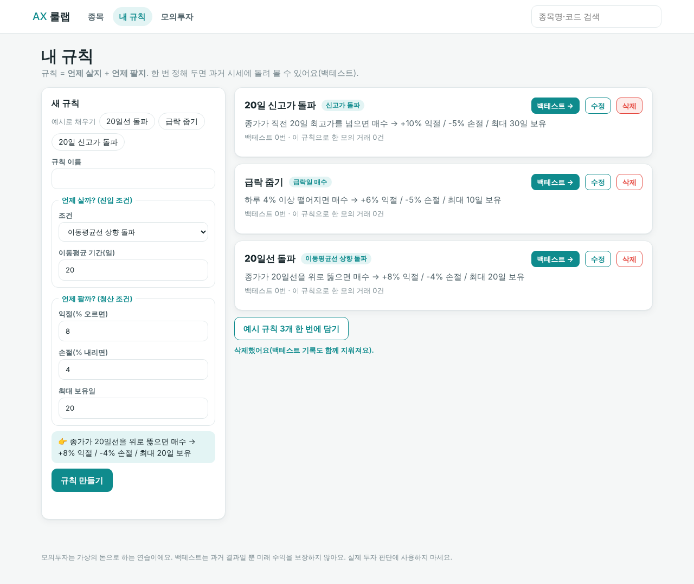
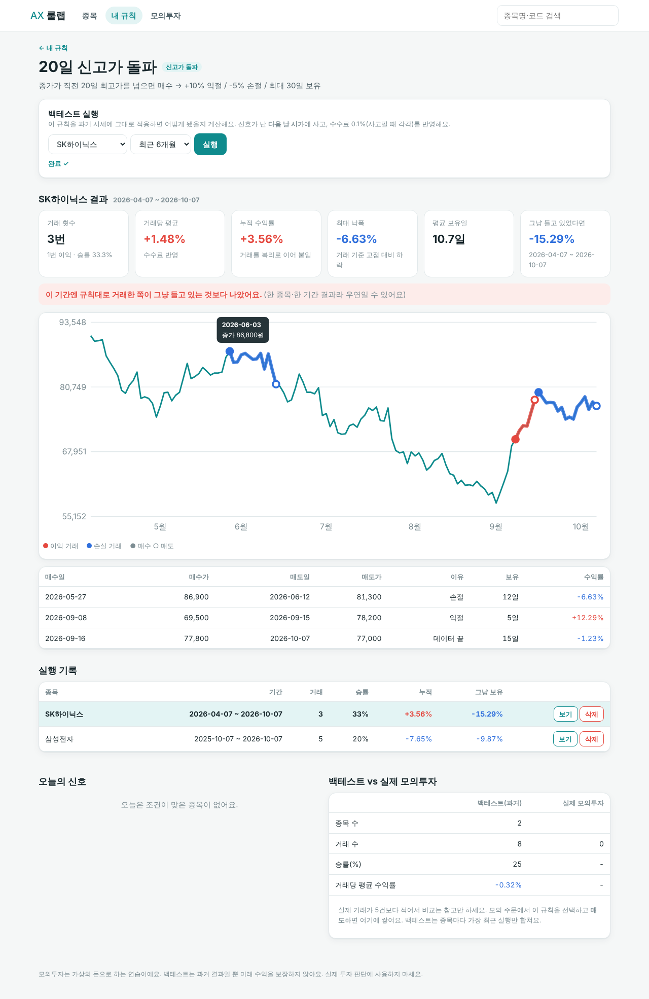
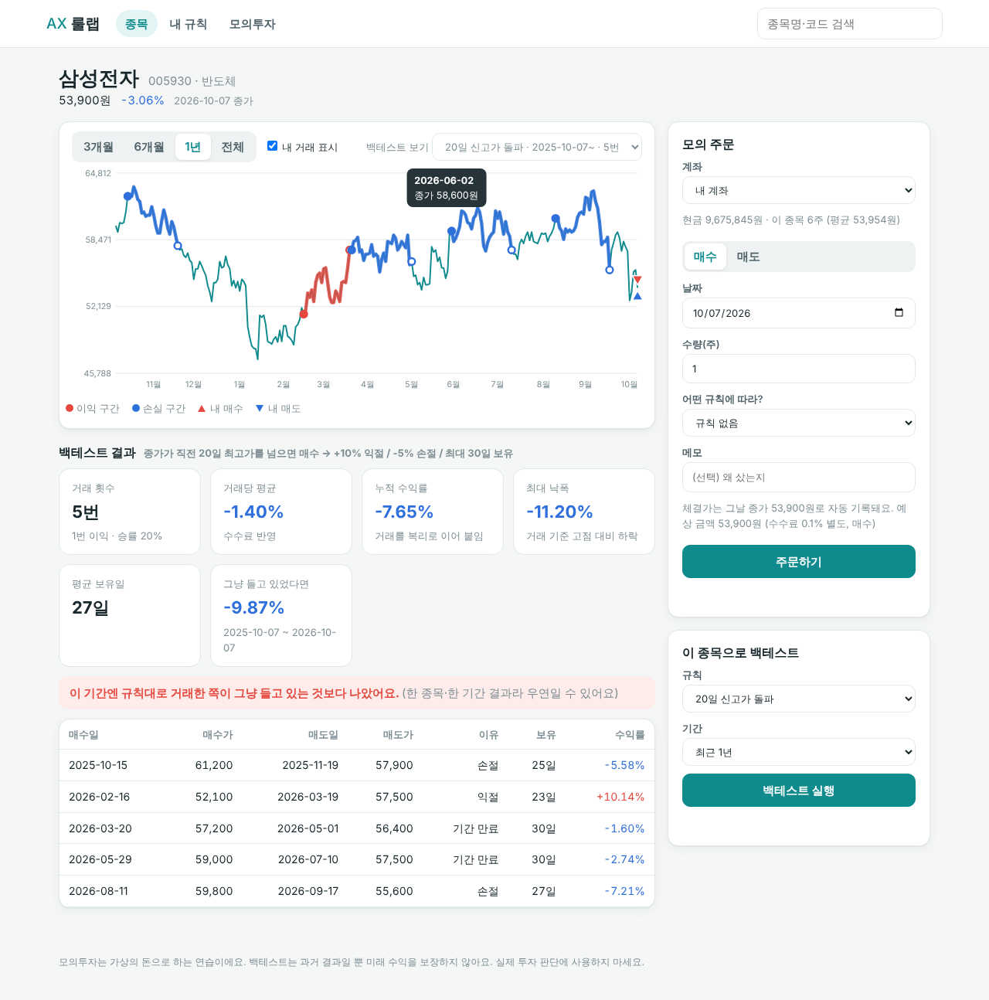
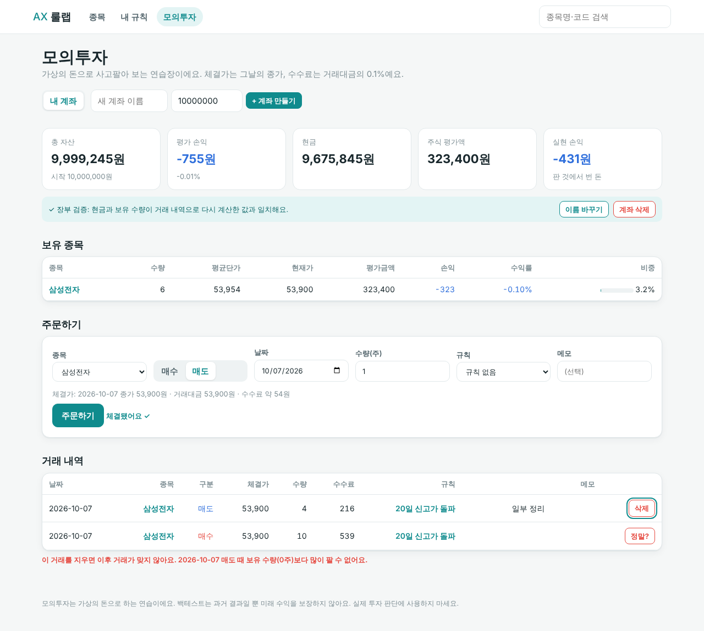
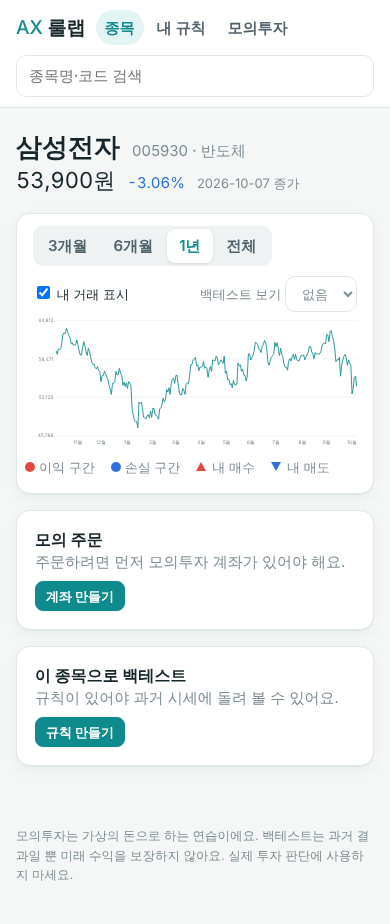

# AX 룰랩 — 규칙 검증 모의투자

> **규칙을 만들고 → 과거 시세로 검증하고(백테스트) → 가상의 돈으로 실행하고(모의투자) → 둘을 비교한다.**
> 반 프로젝트 주제 #4 "AI 주식 종목 분석 대시보드"를 **1차 프로젝트 범위(DB 설계 · SQL · FastAPI CRUD)** 로 푼 버전이에요. AI 대신 *검증 가능한 분석*이 아이디어예요.

## 제외 항목 준수
JWT·OAuth2·React·상태관리·GitHub Actions·E2E 자동화·LLM·LangChain·RAG·Vector DB·Function Calling·AI Agent·뉴스 자동 수집을 **쓰지 않았어요.** 화면은 바닐라 JS, 로그인 대신 브라우저별 `X-Client-Id` 헤더를 써요.

## 화면
| 홈 | 규칙 | 백테스트 |
|---|---|---|
|  |  |  |

| 종목(차트·주문) | 모의투자 | 모바일 |
|---|---|---|
|  |  |  |

## 핵심 기능
1. **규칙 CRUD** — 진입 조건 3종(이동평균 돌파 / 급락 매수 / 신고가 돌파) + 익절·손절·최대 보유일
2. **백테스트** — 신호는 SQL 윈도 함수, 매매는 파이썬. 다음 날 시가 매수·수수료 반영·"그냥 들고 있었다면"과 비교. 결과 저장·차트에 표시
3. **모의투자 장부** — 가격은 그날 종가로 서버가 기록, 잔고 부족·보유 초과 매도 거절, 삭제로 장부가 깨지면 거절, 현금·수량 **감사**
4. **비교** — 규칙별 "백테스트 성적 vs 실제 모의투자 성적", 오늘의 신호

## 실행
```bash
cd backend
pip install -r requirements.txt
uvicorn app.main:app --reload       # http://127.0.0.1:8000  (처음엔 가상 샘플 데이터가 들어가요)
```
API 문서는 `/docs`. PostgreSQL 은 `DATABASE_URL` 환경변수만 바꾸면 돼요(`backend/.env.example`).

### 실제 시세로 바꾸기
```bash
pip install pykrx
python -m app.ingest init-db --reset
python -m app.ingest all            # 종목 → 일봉 시세
```

## 구조
```
db/schema.sql            DDL (9개 테이블, 제약·인덱스)
backend/app/strategy.py  진입 신호 SQL 생성 + 매매 시뮬레이션 + 통계
backend/app/ledger.py    거래 장부 재계산(평균단가법)
backend/app/service.py   모든 업무 로직 (라우터는 이걸 부르기만 해요)
backend/app/dbapi.py     SQLAlchemy / sqlite3 공통 실행 어댑터
backend/app/sql.py       정적 SQL
backend/app/routers/     companies · rules · accounts · system
backend/app/ingest/      pykrx 수집 (parsers · providers · jobs · store · CLI)
backend/app/static/      화면 (index.html · app.js · styles.css)
backend/tests/           test_strategy · test_service · test_ingest · test_api
scripts/explain.py       인덱스 유무 EXPLAIN 비교
```

## 문서
[요구사항](docs/요구사항정의.md) · [ERD·DB 설계](docs/ERD.md) · [백테스트 설명·한계](docs/백테스트설명.md) · [API](docs/API.md) · [데이터 수집](docs/데이터수집.md) · [EXPLAIN](docs/EXPLAIN.md) · [테스트 결과](docs/테스트결과.md)

## 검증 상태 (정직하게)
- ✅ 신호 SQL·시뮬레이션·장부·서비스·수집 로직 테스트 **30개 통과**(sqlite3), 화면 흐름은 같은 service 를 쓰는 목 서버에서 브라우저로 확인
- ⚠️ **FastAPI 서버, `test_api.py`, pykrx 실제 호출, PostgreSQL 은 만든 환경에서 실행해 보지 못했어요.** 처음 돌릴 때 `pytest backend/tests` 부터 확인하세요.
- 샘플 시세는 난수로 만든 가짜예요. 백테스트는 과거 결과일 뿐이고 투자 판단에 쓰면 안 돼요([한계](docs/백테스트설명.md)).

## 다음 단계 아이디어
- 규칙 여러 개를 한 번에 여러 종목에 돌려 순위 매기기, 장중 고저가 반영, 분기 재무 조건 추가
- 2차에서: 로그인(JWT), React 화면, 규칙 설명 자동 생성(LLM) 같은 제외 항목 도입
