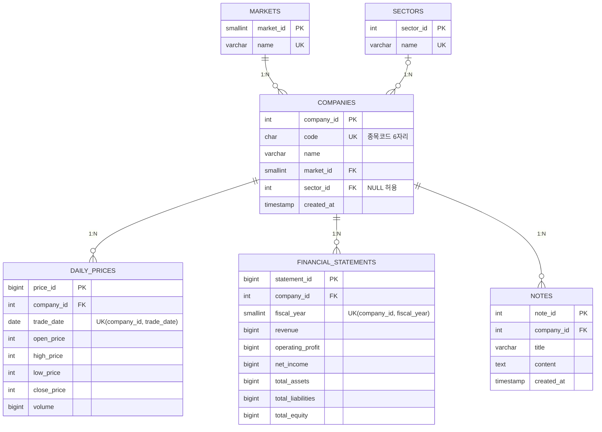

# 05. ERD 및 DB 설계서

DB 생성 스크립트: [`sql/01_schema.sql`](../sql/01_schema.sql) (PostgreSQL 16에서 실행 확인)

## 1. ERD

## 2. 테이블 정의서

### markets
| 컬럼 | 타입 | 키 | 제약 | 설명 |
|---|---|---|---|---|
| market_id | SMALLSERIAL | PK | | 시장 ID |
| name | VARCHAR(20) | UK | NOT NULL | KOSPI, KOSDAQ |

### sectors
| 컬럼 | 타입 | 키 | 제약 | 설명 |
|---|---|---|---|---|
| sector_id | SERIAL | PK | | 업종 ID |
| name | VARCHAR(50) | UK | NOT NULL | 업종명 (팀이 정한 단순 분류) |

### companies
| 컬럼 | 타입 | 키 | 제약 | 설명 |
|---|---|---|---|---|
| company_id | SERIAL | PK | | 종목 ID |
| code | CHAR(6) | UK | NOT NULL | 종목코드 |
| name | VARCHAR(100) | | NOT NULL | 종목명 |
| market_id | SMALLINT | FK → markets | NOT NULL | 시장 |
| sector_id | INT | FK → sectors | NULL 허용 | 업종 |
| created_at | TIMESTAMP | | DEFAULT now() | 등록 시각 |

### daily_prices
| 컬럼 | 타입 | 키 | 제약 | 설명 |
|---|---|---|---|---|
| price_id | BIGSERIAL | PK | | 시세 ID |
| company_id | INT | FK → companies | NOT NULL, ON DELETE CASCADE | 종목 |
| trade_date | DATE | | NOT NULL | 거래일 |
| open_price / high_price / low_price / close_price | INT | | NOT NULL, ≥ 0 | 시·고·저·종가 (원) |
| volume | BIGINT | | NOT NULL, ≥ 0 | 거래량 |
| (표 제약) | | UK | UNIQUE (company_id, trade_date) | 종목·날짜당 1건 |
| (표 제약) | | | CHECK (high_price ≥ low_price) | 고가 ≥ 저가 |

### financial_statements
| 컬럼 | 타입 | 키 | 제약 | 설명 |
|---|---|---|---|---|
| statement_id | BIGSERIAL | PK | | 재무 ID |
| company_id | INT | FK → companies | NOT NULL, ON DELETE CASCADE | 종목 |
| fiscal_year | SMALLINT | | NOT NULL | 사업연도 |
| revenue, operating_profit, net_income | BIGINT | | NULL 허용 | 매출, 영업이익, 순이익 (원) |
| total_assets, total_liabilities, total_equity | BIGINT | | NULL 허용 | 자산, 부채, 자본 (원) |
| (표 제약) | | UK | UNIQUE (company_id, fiscal_year) | 종목·연도당 1건 |

### notes
| 컬럼 | 타입 | 키 | 제약 | 설명 |
|---|---|---|---|---|
| note_id | SERIAL | PK | | 메모 ID |
| company_id | INT | FK → companies | NOT NULL, ON DELETE CASCADE | 종목 |
| title | VARCHAR(100) | | NOT NULL | 제목 |
| content | TEXT | | NOT NULL | 내용 |
| created_at | TIMESTAMP | | DEFAULT now() | 작성 시각 |

### 뷰 v_price_change
`daily_prices` 에 **전일 종가(prev_close)** 와 **등락률(change_pct)** 을 붙여 보여 주는 뷰. 전일 종가는 윈도우 함수 `LAG()` 로 구한다.

## 3. 정규화 검토

| 단계 | 검토 | 이 설계에서 |
|---|---|---|
| 1NF | 한 칸에 값이 하나, 반복 그룹 없음 | 시세는 날짜마다 행, 재무는 연도마다 행. "2024매출, 2025매출" 같은 반복 컬럼을 만들지 않음 |
| 2NF | 복합키의 일부에만 종속된 컬럼 제거 | 대체키(price_id 등)를 PK 로 쓰고, 종목 이름·시장은 시세 테이블에 두지 않음 |
| 3NF | 키가 아닌 컬럼끼리의 종속 제거 | 종목 → 시장/업종 이름은 `markets`/`sectors` 로 분리. 등락률은 종가에서 계산되므로 저장하지 않음 |

**Q. 왜 시장·업종을 `companies` 에 문자열로 넣지 않았나?**
"KOSPI" 를 종목 수만큼 반복 저장하면 오타("코스피", "KOSPI ")로 같은 시장이 갈라지고, 이름을 바꿀 때 모든 행을 고쳐야 한다. 별도 테이블로 두면 한 곳만 고치면 된다.

**Q. 왜 등락률을 컬럼으로 저장하지 않았나?**
등락률은 `close_price` 와 전일 종가로 계산되는 파생값이다. 저장하면 시세를 수정(`PUT /prices/{id}`)했을 때 등락률이 어긋나는 **갱신 이상**이 생긴다. 그래서 뷰로 계산한다. (대신 조회할 때마다 계산하는 비용이 있다.)

**Q. 재무를 "계정명/금액" 행으로 두지 않고 컬럼으로 둔 이유는?**
이번에 쓰는 계정이 6개로 고정이고, 영업이익률·부채비율 같은 계산이 컬럼끼리의 연산이라 SQL 이 단순해진다. 계정을 자주 늘려야 한다면 행 방식이 유리하다. (트레이드오프)

## 4. 인덱스 설계

| 인덱스 | 목적 |
|---|---|
| `uq_price_company_date (company_id, trade_date)` | 중복 방지 + "종목별 기간 조회"를 빠르게 (company_id 로 시작하므로 종목 단독 조회도 커버) |
| `idx_prices_trade_date (trade_date)` | 종목 구분 없이 날짜로 조회하는 랭킹·업종 통계용 |
| `idx_companies_market`, `idx_companies_sector` | 시장/업종별 종목 조회, JOIN |
| `idx_notes_company` | 종목별 메모 조회 |

> **팀이 직접 해 볼 것:** 시세가 수만 건 쌓인 뒤 `EXPLAIN ANALYZE SELECT ... WHERE trade_date = '...'` 를 인덱스 유무(`DROP INDEX idx_prices_trade_date`)로 비교해 결과를 결과보고서에 기록한다. (이 문서에는 아직 측정값이 없다.)

## 5. 삭제 규칙
- 종목 삭제 → 시세·재무·메모 **CASCADE 삭제**
- 종목이 쓰고 있는 시장/업종 삭제 → **거부** (FK, 기본 동작)
